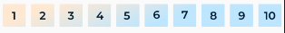
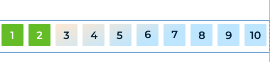

# RatingScale
A rating scale android library

A customizable rating scale supporting a 1-10 scale.

[](https://jitpack.io/#Tilak1114/RatingScale)


<br />


## Usage
#### In your layout.xml
```xml
    <?xml version="1.0" encoding="utf-8"?>
   <androidx.constraintlayout.widget.ConstraintLayout xmlns:android="http://schemas.android.com/apk/res/android"
    xmlns:app="http://schemas.android.com/apk/res-auto"
    xmlns:tools="http://schemas.android.com/tools"
    android:layout_width="match_parent"
    android:layout_height="match_parent"
    tools:context=".MainActivity">

    <com.tilak.ratingscale.RatingScale
        android:layout_width="0dp"
        android:layout_height="wrap_content"
        app:layout_constraintBottom_toBottomOf="parent"
        app:layout_constraintLeft_toLeftOf="parent"
        app:layout_constraintRight_toRightOf="parent"
        app:layout_constraintTop_toTopOf="parent"
        app:rating="2" />

</androidx.constraintlayout.widget.ConstraintLayout>
```

## Download

```groovy
    repositories {
        maven { url "https://jitpack.io" }
    }
    //...
    dependencies {
        //...
        implementation 'com.github.Tilak1114:RatingScale:v{latest-version}'
    }
```
